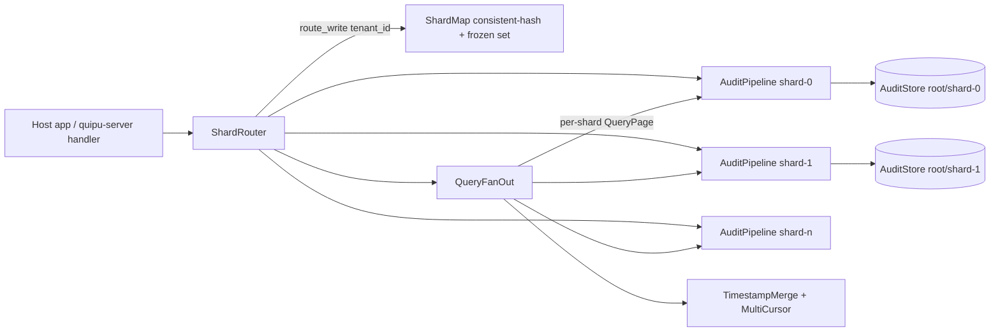
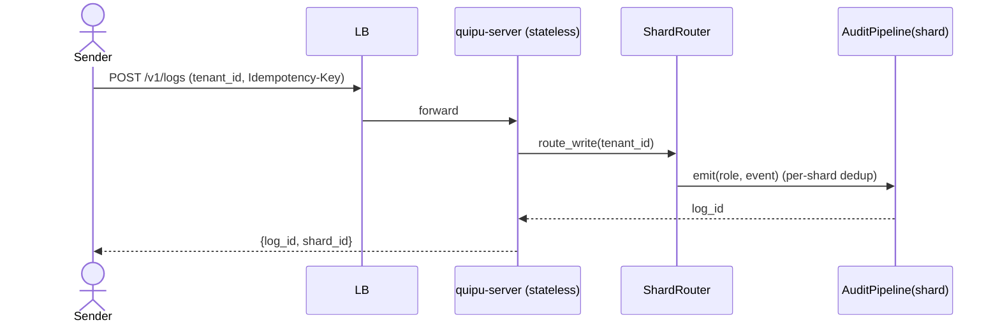

# Solution Design Document — Horizontal Scaling (Sharded Chains + Read Replication)

> Issue: `이슈/Quipu-Log/수평 확장 - 샤딩된 체인과 읽기 복제` (priority A)
> Status: design confirmed (ADR-1..3 by user), ready for implementation.

## Validation Checklist

- [x] All required sections are complete
- [x] No [NEEDS CLARIFICATION] markers remain
- [x] All context sources are listed with relevance ratings
- [x] Project commands are discovered from actual project files
- [x] Constraints → Strategy → Design → Implementation path is logical
- [x] Architecture pattern is clearly stated with rationale
- [x] Every component in diagram has directory mapping
- [x] Every interface has specification
- [x] Error handling covers all error types
- [x] Quality requirements are specific and measurable
- [x] Every quality requirement has test coverage
- [x] **All architecture decisions confirmed by user** (ADR-1..3)
- [x] Component names consistent across diagrams
- [x] A developer could implement from this design

---

## Constraints

- CON-1 **The single-writer-per-chain invariant is non-negotiable.** A hash chain is sound only while exactly one writer owns it. Scaling MUST NOT introduce multiple writers onto one chain, nor a cross-node consensus that could regress "this log wasn't altered" into "probably wasn't." (README "Why no distributed storage".)
- CON-2 **Rust workspace, MSRV 1.89, no new heavy dependencies.** Sharding builds on `std::fs` + `std::thread`; no external DB, no replication library. `unsafe` stays confined to the existing two `libc::statvfs` calls.
- CON-3 **Append-only is permanent.** Sealed segments and the chain are immutable. Any scheme that requires moving an already-written record across shards is out — chains cannot be rebalanced.
- CON-4 **Per-shard guarantees must equal today's single-node guarantees.** Each shard keeps the full tamper-evidence story: hash chain + signed checkpoints + external anchoring + `verify_integrity`.
- CON-5 **Backward compatibility.** A single-shard deployment (N=1) must behave exactly like today's embedded/server store, on the same on-disk layout. Sharding is additive.

## Implementation Context

**IMPORTANT**: All listed sources were read and analyzed.

### Required Context Sources

- ICO-1 project-wide context
 ```yaml
 - doc: README.md
   relevance: HIGH
   sections: ["Why no distributed storage", "Performance > Scale and its limits", "Server mode"]
   why: "States the single-writer rationale this design must respect and reframe, not violate"
 - doc: SECURITY.md
   relevance: HIGH
   sections: ["Scope and threat model > Single-writer by design"]
   why: "Documents single-writer as a scope decision; sharding refines it to per-chain"
 - doc: CHANGELOG.md
   relevance: MEDIUM
   sections: ["Compatibility policy"]
   why: "On-disk format and DLQ format contracts constrain shard layout"
 ```
- ICO-2 quipu-core (storage engine)
 ```yaml
 - file: crates/quipu-core/src/store.rs
   relevance: HIGH
   sections: [StoreConfig, AuditStore::open, SyncPolicy, AnchorHook, verify_integrity]
   why: "A shard IS one AuditStore over one root. Shard abstraction wraps this unchanged."
 - file: crates/quipu-core/src/checkpoint.rs
   relevance: HIGH
   why: "Per-shard signed checkpoints are the cross-shard integrity story (no global chain)"
 - file: crates/quipu-core/src/crypto.rs
   relevance: MEDIUM
   sections: [KeyRing, KeyVersion]
   why: "Key sharing/isolation policy across shards (ADR-4 candidate, default shared)"
 - file: crates/quipu-core/src/query.rs
   relevance: HIGH
   sections: [LogQuery, QueryPage, Order, cursor]
   why: "Cross-shard fan-out must merge per-shard QueryPages and keep the cursor contract"
 ```
- ICO-3 quipu-middleware (pipeline) & quipu-server (daemon) & quipu-client (sender)
 ```yaml
 - file: crates/quipu-middleware/src/pipeline.rs
   relevance: HIGH
   sections: [AuditPipeline::start, AuditHandle, emit, query, snapshot, metrics]
   why: "A shard IS one AuditPipeline (its own writer thread). Router holds N of them."
 - file: crates/quipu-server/src/serve.rs
   relevance: HIGH
   why: "HTTP front becomes shard-aware: tenant -> shard -> pipeline"
 - file: crates/quipu-server/src/api.rs
   relevance: HIGH
   sections: [DedupWindow, Idempotency-Key handling, POST /v1/logs]
   why: "Idempotency moves per-shard; routing happens before dedup"
 - file: crates/quipu-client/src/client.rs
   relevance: MEDIUM
   sections: [new_idempotency_key, occurred_at, spool]
   why: "Sender already supplies the parts a stateless ingest front needs; unchanged"
 ```

### Implementation Boundaries

- **Must Preserve**: per-shard on-disk layout and `AuditStore`/`AuditPipeline` semantics; `verify_integrity` per shard; existing single-node HTTP API for N=1; `Idempotency-Key` and `occurred_at` contracts; query cursor semantics within a shard.
- **Can Modify**: `quipu-server` request entry (add routing layer); add a sharding module in `quipu-middleware`; server config schema (add `[shards]`); README "Why no distributed storage".
- **Must Not Touch**: the chain/segment/checkpoint formats; `quipu-core` storage internals; the single-writer thread model inside a pipeline.

### External Interfaces

#### System Context Diagram

```mermaid
graph TB
    subgraph Senders
      SvcA[Service A]
      SvcB[Service B]
      Auditor[Auditor / SIEM]
    end
    LB[Load Balancer]
    subgraph IngestTier[Stateless ingest front - N replicas]
      F1[quipu-server front]
      F2[quipu-server front]
    end
    subgraph WriteTier[Shard writers - single writer per shard]
      S0[(shard-0 store + writer)]
      S1[(shard-1 store + writer)]
      Sn[(shard-n active)]
      Sf[(frozen shards - read only)]
    end
    subgraph ReadTier[Read replicas - query fan-out]
      R1[query node]
      R2[query node]
    end

    SvcA --> LB
    SvcB --> LB
    LB --> F1
    LB --> F2
    F1 -->|hash(tenant) -> active shard| S0
    F1 --> S1
    F2 --> Sn
    Auditor --> R1
    R1 -->|fan-out + ts-merge| S0
    R1 --> S1
    R1 --> Sf
    S0 -.sealed segments rsync/snapshot.-> R1
    Sn -.replicate.-> R2
```

#### Interface Specifications

```yaml
inbound:
  - name: "Ingest API (write)"
    type: HTTPS
    format: REST/JSON
    authentication: Bearer token (per-tenant role grants)
    data_flow: "Audit events; routed by tenant_id to owning shard writer"
    note: "Same POST /v1/logs as today; Idempotency-Key honored per shard"
  - name: "Query API (read)"
    type: HTTPS
    format: REST/JSON
    authentication: Bearer token (Query/Administer grants)
    data_flow: "Log queries; fanned out across shards, merged by timestamp"

outbound:
  - name: "External anchor sink (per shard)"
    type: hook (host-provided)
    format: signed checkpoint bytes
    data_flow: "Each shard exports its checkpoint signatures off-box"
    criticality: HIGH

data:
  - name: "Shard store roots"
    type: directory per shard (std::fs)
    connection: AuditStore::open per shard
    data_flow: "root/<shard-id>/{logs,registry,access,dlq,...}"
  - name: "Read-replica copies"
    type: read-only directory copies of sealed segments
    connection: rsync/snapshot (operator-driven), opened read-only
    data_flow: "query fan-out reads replicas; active tail lags by replication interval"
```

### Cross-Component Boundaries

- **API Contracts**: `POST /v1/logs`, `POST /v1/query`, `POST /v1/admin/verify` keep their request/response shapes. Query responses gain an optional per-shard cursor map (back-compatible: absent for N=1).
- **Team Ownership**: single project; no cross-team split.
- **Shared Resources**: KeyRing may be shared across shards (ADR-4, default) or split per shard; the LB is external.
- **Breaking Change Policy**: N=1 is byte-compatible with the current store. The query cursor format change is additive (opaque cursor; clients echo it back).

### Project Commands

```bash
# Component: quipu-log workspace
Location: ~/Desktop/quipu-log

## Environment Setup
Install Dependencies: cargo fetch
Start Development: cargo run -p quipu-server -- <config.json>

# Testing
Unit/Integration Tests: cargo test --workspace
Doctests: cargo test --doc --workspace
Fuzz (nightly, separate workspace): cd fuzz && cargo +nightly fuzz run <target>
Bench (write path): cargo bench -p quipu-middleware --bench write_path
NEW Bench (shard scaling): cargo bench -p quipu-middleware --bench shard_scaling

# Code Quality
Linting: cargo clippy --workspace --all-targets -- -D warnings
Formatting: cargo fmt --all

# Build
Build Project: cargo build --workspace --release
```

## Solution Strategy

- **Architecture Pattern**: *Partitioned single-writer* — N independent stores, each an existing `AuditPipeline` (one writer thread, one chain, one registry), fronted by a stateless router for writes and a stateless fan-out for reads. There is no shared chain and no inter-node consensus.
- **Integration Approach**: Add a thin `ShardRouter` in `quipu-middleware` that owns `Vec<AuditPipeline>` plus a `ShardMap`. `quipu-server` routes by `tenant_id`. `quipu-core` is untouched: a shard *is* an `AuditStore`. N=1 collapses to today's behavior.
- **Justification**: This honors CON-1/CON-3/CON-4 — each chain keeps exactly one writer and never moves records — while delivering ~N× write throughput (N writer threads) and unbounded read throughput (immutable sealed segments replicate freely). It reuses the entire existing engine; the new surface is routing + fan-out merge, both stateless and testable in isolation.
- **Key Decisions**: shard key = `hash(tenant_id)` (ADR-1); no global total *order*, per-shard checkpoints + timestamp-merged reads (ADR-2); resharding = add-only with frozen shards via consistent hashing (ADR-3); KeyRing shared across shards by default, isolatable (ADR-4); **global *integrity* preserved by cross-shard checkpoint anchoring** (ADR-5) — distinct from ordering.

### Alternatives considered (and where they fit)

The issue laid out four scaling options; this design takes **B + D**.

- **A — Raft / replicated single writer (availability).** Wraps one chain's single writer in consensus so a leader failure doesn't stall writes. It buys *availability*, not throughput (one leader still owns the chain), and is orthogonal to sharding (each shard could be its own Raft group). Out of scope here — availability is tracked by `이슈/Quipu-Log/서버 모드 가용성과 단일 장애점` (cold standby today); Raft is its future upgrade.
- **B — Sharding (write throughput).** *Chosen.* Independent single-writer chains partitioned by tenant. Linear write scaling, every chain keeps its invariant.
- **C — Decoupled sequencing / Merkle tree (Trillian-style; storage+read scale + proofs).** A sequencer assigns only leaf indices; storage distributes; a Merkle tree replaces the linear chain and yields inclusion + consistency proofs — a stronger integrity model than a linear chain. Deferred: it is the largest redesign (new on-disk model, new verify), and B+D meets the stated throughput need without it. Recorded as the path to take if provable inclusion/large-scale read becomes a requirement.
- **D — Cross-shard checkpoint anchoring (global integrity glue).** *Chosen, pairs with B.* See ADR-5.

## Building Block View

### Components



### Directory Map

**Component**: quipu-middleware
```
crates/quipu-middleware/src/
├── lib.rs                 # MODIFY: re-export sharding types
├── pipeline.rs            # unchanged (a shard is one pipeline)
└── sharding/              # NEW module
    ├── mod.rs             # NEW: ShardRouter, ShardId, public API
    ├── shard_map.rs       # NEW: ShardMap (consistent hashing, active/frozen sets, route_write/route_read)
    ├── fanout.rs          # NEW: QueryFanOut — fan-out + timestamp merge + MultiCursor
    └── metrics.rs         # NEW: aggregate per-shard MetricsSnapshot
crates/quipu-middleware/tests/
└── sharding.rs            # NEW: routing, fan-out merge, per-shard verify, resharding-freeze
crates/quipu-middleware/benches/
└── shard_scaling.rs       # NEW: throughput vs shard count curve
```

**Component**: quipu-server
```
crates/quipu-server/src/
├── config.rs              # MODIFY: add ShardsSection (mode: single|sharded, shard roots, frozen set, hash seed)
├── serve.rs               # MODIFY: build ShardRouter instead of a single pipeline
├── api.rs                 # MODIFY: extract tenant_id, route_write; dedup per shard; query fan-out
└── lib.rs                 # MODIFY: wire shard config
```

**Component**: docs
```
docs/specs/horizontal-scaling/
└── solution-design.md     # THIS FILE (NEW)
```

### Interface Specifications

#### Data Storage Changes

```yaml
# No format change. Layout gains a shard level above the existing store layout.
Layout (sharded):
  root/
    shards.json            # NEW: ShardMap manifest (versioned): active[], frozen[], hash_seed, key_policy
    shard-0000/            # each is a complete AuditStore root (logs, registry, access, dlq, checkpoints)
    shard-0001/
    ...
Layout (single, N=1, unchanged):
  root/{logs,registry,access,dlq,...}   # byte-compatible with today
schema_doc: per-shard layout == current AuditStore layout (crates/quipu-core/src/storage)
```

#### Internal API Changes

```yaml
Endpoint: Emit (write)
  Method: POST
  Path: /v1/logs
  Request:
    event: AuditEvent            # unchanged
    tenant_id: string            # NEW (header X-Quipu-Tenant or event field); required in sharded mode
    Idempotency-Key: string      # unchanged; deduped within the owning shard
  Response: { log_id, shard_id }  # shard_id added (informational)
  Errors: 404-equivalent if tenant maps to a frozen-only shard for writes -> re-route to active

Endpoint: Query (read)
  Method: POST
  Path: /v1/query
  Request:
    query: LogQuery              # unchanged
    tenant_id: string (optional) # if present -> single-shard fast path; absent -> fan-out all shards
    cursor: MultiCursor (opaque) # NEW: map<shard_id, per-shard cursor>; absent on first page
  Response:
    hits: [LogView]              # merged, globally ordered by timestamp (Order from query)
    next_cursor: MultiCursor     # opaque; echo back for next page
  note: N=1 -> MultiCursor has one entry; wire-compatible with today's single cursor

Endpoint: Verify (integrity)
  Method: POST
  Path: /v1/admin/verify
  Request: { shard_id: optional } # absent -> verify all shards sequentially
  Response: { per_shard: map<shard_id, VerifyReport> }
```

#### Application Data Models

```pseudocode
ENTITY: ShardId (NEW)            # newtype over u32 / zero-padded string "shard-0000"

ENTITY: ShardMap (NEW)
  FIELDS:
    hash_seed: u64
    active: Vec<ShardId>         # writable; hash(tenant) % active.len() -> but see consistent hashing
    frozen: Vec<ShardId>         # read-only; never selected for writes
    ring: ConsistentHashRing     # tenant -> shard; frozen shards remain on ring for READS only
    key_policy: Shared | PerShard
  BEHAVIORS:
    route_write(tenant_id) -> ShardId        # only active shards
    route_read(tenant_id) -> ShardId         # the shard that owns/owned the tenant (active or frozen)
    all_shards() -> impl Iterator<ShardId>   # for fan-out
    freeze(ShardId); add_active(ShardId)     # resharding ops (rewrites shards.json atomically)

ENTITY: ShardRouter (NEW)
  FIELDS: pipelines: HashMap<ShardId, AuditPipeline>, map: ShardMap
  BEHAVIORS:
    emit(role, tenant_id, event) -> Result    # route_write -> pipeline.emit
    query(role, tenant_id?, query, cursor?) -> MergedPage
    snapshot/list/history (route_read or fan-out)
    verify(shard_id?) -> per-shard VerifyReport
    metrics() -> aggregated MetricsSnapshot
    redrive_dlq / flush (fan-out to all)

ENTITY: MultiCursor (NEW)
  FIELDS: per_shard: BTreeMap<ShardId, ShardCursor>   # opaque, serde; only shards with remaining rows
```

#### Integration Points

```yaml
- from: quipu-server::api
  to: quipu-middleware::sharding::ShardRouter
  protocol: in-process call
  data_flow: "extract tenant_id from header/event -> route_write/route_read"
- from: ShardRouter
  to: AuditPipeline (per shard)
  protocol: in-process (existing handle.emit/query)
  data_flow: "events to owning writer; queries fanned out"
- External (read replication):
  integration: "operator rsync/snapshot of sealed segments to query nodes; query node opens shard roots read-only"
  critical_data: "sealed segments (immutable), checkpoints; active tail excluded until flush"
```

### Implementation Examples

#### Example: Cross-shard query merge (timestamp k-way merge with per-shard cursor)

**Why this example**: the only genuinely new algorithm; it must preserve global ordering and a resumable cursor without a global index.

```rust
// Fan out the same LogQuery to every shard (or one shard on the tenant fast path),
// then k-way merge by timestamp. Each shard returns its own opaque cursor; the
// MultiCursor is just the set of shard cursors that still have rows.
fn query_merged(
    router: &ShardRouter, role: &Role, q: &LogQuery, cursor: Option<MultiCursor>, limit: usize,
) -> Result<MergedPage, MiddlewareError> {
    // 1. Per-shard sub-query: ask each shard for up to `limit` rows from its cursor.
    let mut heads: Vec<(ShardId, std::vec::IntoIter<LogView>, Option<ShardCursor>)> = vec![];
    for shard in router.read_targets(q) {           // one shard (tenant given) or all shards
        let start = cursor.as_ref().and_then(|c| c.per_shard.get(&shard).cloned());
        let page = router.pipeline(shard).query_page(role, q, start, limit)?;
        heads.push((shard, page.hits.into_iter(), page.next_cursor));
    }
    // 2. K-way merge by timestamp honoring q.order (desc default), bounded by `limit`.
    let mut out = Vec::with_capacity(limit);
    let mut next = MultiCursor::default();
    // BinaryHeap keyed by (timestamp, shard) per q.order; pop `limit`, track each shard's
    // last-emitted position so a partially-drained shard resumes exactly where it stopped.
    // (full impl: peekable iterators + heap; omitted for brevity)
    Ok(MergedPage { hits: out, next_cursor: next.non_empty() })
}
```

## Runtime View

### Primary Flow: Emit (write)

1. Sender POSTs an event with `tenant_id` + `Idempotency-Key` (quipu-client already mints these).
2. Stateless front extracts `tenant_id`; `ShardMap::route_write` picks the owning **active** shard.
3. That shard's `AuditPipeline` dedups the idempotency key (per shard) and enqueues to its single writer thread.
4. Writer appends to the shard's chain, fsyncs per `SyncPolicy`, seals/checkpoints/anchors on segment boundaries — exactly as today.
5. Response returns `{log_id, shard_id}`.



### Primary Flow: Query (read, fan-out)

1. Auditor POSTs a `LogQuery` (optionally `tenant_id`) + optional `MultiCursor`.
2. With `tenant_id`: `route_read` → single shard fast path. Without: fan-out to all shards (active + frozen).
3. Each shard returns up to `limit` rows from its own cursor.
4. Front k-way merges by timestamp per `Order`, emits `limit` rows, returns a `MultiCursor` for resumption.

### Error Handling

- **Unknown/empty tenant_id in sharded mode (write)**: reject `400 tenant_id required`; do not silently pick a shard (would split a tenant across chains).
- **Tenant maps to a frozen shard on write**: `route_write` always returns an active shard (frozen excluded from the write ring); new writes land on the active owner. No error.
- **One shard down/wedged during fan-out read**: return partial results with a `degraded: [shard_id]` marker and HTTP 200 (audit reads must not fully fail because one replica lags); `verify`/metrics expose the unhealthy shard. (Mirrors existing healthz "degraded=200" choice.)
- **Idempotency replay after reshard (tenant moved active shard)**: dedup is per shard; a replay hitting the new active shard is deduped there. The old shard is frozen (read-only) so no double-write is possible.
- **Cursor references a now-frozen shard**: still valid — frozen shards are readable; the cursor resumes against the frozen store.

### Complex Logic: consistent hashing with add-only + freeze (resharding)

```
ALGORITHM: route + reshard
STATE: ring (virtual nodes -> shard), active:set, frozen:set

route_write(tenant):
  s = ring.lookup(hash(tenant, seed))
  if s in frozen: s = active_ring.lookup(hash(tenant, seed))   # frozen never takes writes
  return s

reshard_add(new_shard):
  1. create empty AuditStore at root/<new_shard>
  2. freeze the currently-hot active shard(s) as policy dictates  # existing data stays put (CON-3)
  3. add new_shard to active set + ring; atomically rewrite shards.json
  # past records never move; a tenant's history may span [frozen owner ... current active owner]
  # reads fan-out or follow the tenant across its (frozen, active) shards

INVARIANT: each shard has exactly one writer for its entire life; once frozen it takes no writes ever again.
```

## Deployment View

### Single Application Deployment (N=1, default)
- **Environment**: unchanged. One `quipu-server` process, one store root. Byte-compatible with today.
- **Configuration**: `shards.mode = "single"` (or omit `[shards]`).

### Multi-Component Coordination (sharded mode)
- **Topology**: 1 LB → M stateless ingest fronts → N shard writers (each owns its store root + writer thread). Optionally K read-replica query nodes holding rsync'd sealed segments.
- **Deployment Order**: shard writers first (own the locks), then stateless fronts, then read replicas.
- **Single-writer enforcement**: each shard root is guarded by the existing `std::fs::File::try_lock` (Rust 1.89). Two processes cannot both write a shard. Stateless fronts hold no store lock; they only route.
- **Replication**: operator rsync/snapshot of *sealed* segments to read nodes; active tail excluded (flush for point-in-time). Read nodes open shard roots read-only.
- **Config** (as implemented): a `shards` section `{ count, frozen: [ids], hash_seed, tenant_header? }` turns on sharded mode; its absence is single-store mode (byte-compatible). Each shard's store lives under `store.root/shard-NNNN` and inherits the top-level `store`/`keys` config (KeyRing shared, ADR-4 default). Writes carry the tenant in `tenant_header` (default `X-Quipu-Tenant`), required on writes, optional on reads (absent ⇒ fan-out).
- **Rollback**: sharded → single is not automatic (data lives in N roots). Plan capacity up front; resharding is add-only.

## Cross-Cutting Concepts

### System-Wide Patterns
- **Security**: per-shard tamper-evidence is identical to today (chain + checkpoint + anchor + verify). KeyRing shared across shards by default (ADR-4) — one rotation/rekey policy; `per_shard` isolates blast radius at the cost of N key sets. The **signing key must still live off the writer box** (README "Key management") — sharding multiplies writer boxes, so anchor/sign separation matters more, not less.
- **Error Handling**: per-shard, reusing pipeline DLQ/fallback. Fan-out reads degrade (partial + marker) rather than fail.
- **Performance**: write = N independent writer threads (no shared lock on the hot path); read = immutable sealed segments replicate to K nodes. Routing and merge are O(1)/O(shards·limit) and stateless.
- **Logging/Auditing**: each shard keeps its own access log (meta-audit) and metrics; `ShardRouter::metrics()` aggregates.

### State Management
- Stateless fronts/read nodes hold **no** durable state; all state is in shard roots. The only shared manifest is `shards.json` (read by fronts, written only by reshard ops with atomic rename).

### Performance Characteristics
- Target scaling: write throughput ≈ linear in active shard count until disk/IO bound; read throughput ≈ linear in read-replica count. Cross-shard query latency ≈ slowest shard's sub-query + merge.

### Test Pattern
```pseudocode
TEST: "events route to one shard per tenant and never split a chain"
  SETUP: router with N shards, T tenants
  EXECUTE: emit many events across tenants concurrently
  VERIFY: each tenant's events all in one shard; each shard verify_integrity OK; total count preserved

TEST: "cross-shard query is globally ordered and cursor-resumable"
  SETUP: known events across shards with interleaved timestamps
  EXECUTE: paginate with limit < total via MultiCursor
  VERIFY: concatenated pages == single global timestamp order, no dup/gap
```

## Architecture Decisions

- [x] ADR-1 **Shard key = `hash(tenant_id)`**: partition the audit stream by tenant.
  - Rationale: multi-tenant SaaS aligns naturally; per-tenant queries hit a single shard (fast path); tenant-level isolation aids regulatory boundaries (per-tenant retention/keys later).
  - Trade-offs: cross-tenant audit queries fan out to all shards; a hot tenant is bounded by one shard's writer (mitigate via sub-sharding that tenant later).
  - User confirmed: **Yes (2026-06-13)**

- [x] ADR-2 **No global total order; per-shard checkpoints + timestamp-merged reads**.
  - Rationale: audit needs in-shard order + per-shard signed checkpoints, not a single global timeline; avoids any cross-shard consensus (honors CON-1).
  - Trade-offs: no single monotonic global sequence; cross-shard ordering is by `timestamp` (clock-based), so equal-timestamp cross-shard ties are ordered by (timestamp, shard_id).
  - User confirmed: **Yes (2026-06-13)**

- [x] ADR-3 **Resharding = add-only with frozen shards (consistent hashing)**.
  - Rationale: chains are append-only and cannot be rebalanced (CON-3). Freezing existing shards read-only and routing new writes to new shards preserves every chain's single-writer-for-life invariant with zero data movement.
  - Trade-offs: shard count only grows; a tenant's history can span a frozen owner + a current active owner (reads follow both); operator must plan growth.
  - User confirmed: **Yes (2026-06-13)**

- [ ] ADR-4 **KeyRing policy: shared across shards by default, `per_shard` opt-in**.
  - Rationale: one rotation/rekey procedure is far simpler operationally; matches today's single-KeyRing mental model. `per_shard` available for tenants needing isolated key blast radius.
  - Trade-offs: shared keys mean one leaked key affects all shards' RSA data (re-key is per shard but under one policy); per-shard multiplies key management N×.
  - User confirmed: _Pending (default assumed: shared)_

- [ ] ADR-5 **Cross-shard checkpoint anchoring (option D) for global integrity**.
  - Decision: periodically sign a **global head** = the set of `{shard_id → latest signed checkpoint head}` together with the `shards.json` manifest (hash), and export that signature to the same external anchor each shard already uses.
  - Why it is needed even though there is no global *order* (ADR-2): sharding opens an attack that per-shard `verify_integrity` cannot see — **dropping or rolling back an entire shard**, or editing the shard manifest to hide a shard. Each surviving shard still verifies clean. Anchoring the *set* of shard heads + the manifest makes "a shard went missing / went backwards / the map changed" detectable, so splitting the log into shards does not weaken global tamper-evidence. Ordering is clock-based (ADR-2); integrity is cryptographic (this ADR) — independent concerns.
  - Mechanism: reuses the existing per-shard checkpoint signing (`quipu-core::checkpoint`) over a small `GlobalCheckpoint { signed_at, manifest_hash, heads: Vec<ShardHead>, key_version, signature }` (`ShardHead = {shard, chain_head_hex, record_count}`). Verification recomputes each shard's current head, compares to the last anchored `GlobalCheckpoint`, and flags missing/rolled-back shards or a changed manifest.
  - Trade-offs: the global checkpoint cadence bounds detection latency for whole-shard loss; record counts shrink under retention, so the anchor must be re-signed after a retention run (a stale anchor reads a retention drop as a rollback); the signing key must live off the shard boxes (same separation rule as per-shard anchoring — see README "Key management").
  - Status: **implemented** — `quipu_middleware::sharding::anchor` (`GlobalCheckpoint`/`ShardHead`/`GlobalVerifyReport`), `ShardRouter::global_checkpoint()` + `verify_global()`, manifest pinned via `ShardMap::manifest_bytes()`, shard head exposed via `AuditHandle::checkpoint()`. Tests: `tests/sharding.rs` (signature tamper, whole-shard rollback, shard deletion + manifest change).
  - User confirmed: _Yes — B+D recommended (2026-06-13)_

## Quality Requirements

- **Performance**: aggregate durable write throughput scales ≥ 0.8×N of single-shard throughput up to N=8 on one box (IO permitting), measured by `shard_scaling` bench. Cross-shard query adds ≤ merge overhead over the slowest shard sub-query.
- **Security**: every shard independently passes `verify_integrity`; no code path lets two writers touch one shard (enforced by file lock + test).
- **Reliability**: one lagging/unhealthy shard degrades reads (partial + marker), never corrupts or blocks other shards' writes. N=1 is byte-identical to today (regression test).
- **Correctness**: cross-shard pagination yields exact global timestamp order with no duplicates or gaps across pages (property test).

## Risks and Technical Debt

### Known Technical Issues
- Clock skew across shard writer hosts affects cross-shard ordering (events ordered by `timestamp`/`occurred_at`). Mitigate: document NTP requirement; ties broken by shard_id deterministically.

### Technical Debt
- `verify` fan-out runs sequentially on writer threads today (per `암묵지/Quipu-Log 무결성 검증 경계`): with many shards, a global verify is slow. Future: snapshot-based verify off the writer thread.

### Implementation Gotchas
- `use quipu_core::*` glob shadows `std::result::Result` — fully-qualify in any new doctest (seen in the quick-start doctest).
- Idempotency window is per shard; a client that changes the tenant_id on retry would bypass dedup — clients must keep tenant_id stable per logical event (quipu-client does).
- `shards.json` must be rewritten atomically (temp + rename) so a crash mid-reshard never yields a half-written manifest; mirror the store's existing torn-tail discipline.

## Test Specifications

### Critical Test Scenarios

**Scenario 1: Sharded write happy path**
```gherkin
Given: a ShardRouter with 4 active shards
When: 10k events across 100 tenants are emitted concurrently
Then: every tenant's events live in exactly one shard
And: each shard's verify_integrity passes
And: total persisted count == 10k (no loss, no dup)
```

**Scenario 2: Cross-shard pagination**
```gherkin
Given: events with interleaved timestamps spread over all shards
When: the log is paginated with limit smaller than total via MultiCursor
Then: concatenated pages equal the single global timestamp ordering
And: there are no duplicate or missing rows across page boundaries
```

**Scenario 3: Degraded read (one shard down)**
```gherkin
Given: a fan-out query and one shard made unavailable
When: the query runs
Then: results from healthy shards return with HTTP 200
And: the response marks the missing shard as degraded
And: other shards' writes are unaffected
```

**Scenario 4: Resharding freeze**
```gherkin
Given: an active shard with existing tenant history
When: a reshard adds a new active shard and freezes the old one
Then: the old shard takes no further writes (single-writer-for-life holds)
And: new writes for an existing tenant land on an active shard
And: reads still find the tenant's pre-freeze history on the frozen shard
```

### Test Coverage Requirements
- **Business Logic**: route_write/route_read, consistent-hash distribution, frozen exclusion, k-way merge + cursor resume.
- **Integration Points**: server tenant extraction + per-shard dedup; fan-out verify.
- **Edge Cases**: N=1 compatibility; empty shard; tenant spanning frozen+active; cursor over frozen shard; equal-timestamp cross-shard tie-break.
- **Performance**: `shard_scaling` bench (throughput vs N).
- **Security**: per-shard verify_integrity; double-writer prevention via file lock.

---

## Glossary

### Domain Terms
| Term | Definition | Context |
|------|------------|---------|
| Shard | An independent `AuditStore` (own chain, registry, checkpoints, single writer) | Unit of horizontal partitioning |
| Tenant | Logical customer/owner; the shard key | `hash(tenant_id)` → shard |
| Frozen shard | A shard that has permanently stopped taking writes; read-only | Resharding (add-only) |

### Technical Terms
| Term | Definition | Context |
|------|------------|---------|
| Single-writer-per-chain | Exactly one writer owns a hash chain for its whole life | CON-1; preserved per shard |
| MultiCursor | Map of per-shard opaque cursors for resumable cross-shard pagination | Query fan-out |
| Consistent hashing | Ring mapping tenant→shard that minimizes remap on growth | Resharding |

### API/Interface Terms
| Term | Definition | Context |
|------|------------|---------|
| route_write / route_read | Pick the active (write) / owning (read) shard for a tenant | ShardRouter |
| Fan-out | Issue the same query to all shards and merge | Cross-tenant reads |
| Idempotency-Key | Client-supplied dedup key, honored per shard | POST /v1/logs |
